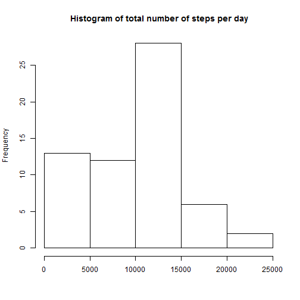
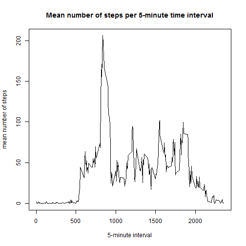
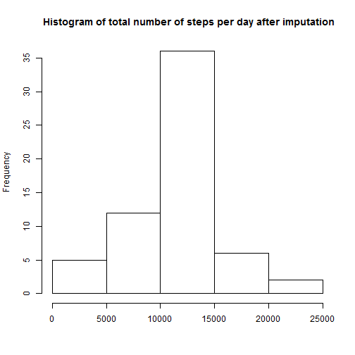

# Analysis of measurements of a activity tracker  

Klaske Grimmerink


# Loading and preprocessing the data

```r
act<-read.csv("activity.csv",header=T)
act$date<-as.Date(act$date,"%Y-%m-%d")
sum(is.na(act))
```

```
## [1] 2304
```
There are some missing values in the first days, but we can ignore them.

# What is mean total number of steps taken per day?


```r
totsteps<-tapply(act$steps,act$date,sum,na.rm=T)
head(totsteps) 
```

```
## 2012-10-01 2012-10-02 2012-10-03 2012-10-04 2012-10-05 2012-10-06 
##          0        126      11352      12116      13294      15420
```

```r
hist(totsteps,xlab=" ", main=" Histogram of total number of steps per day")
```



```r
mean(totsteps) 
```

```
## [1] 9354.23
```

```r
median(totsteps) 
```

```
## [1] 10395
```
The mean of the total number of steps taken per day is 9354 and the median is 10395.

# What is the average daily activity pattern?

```r
stepsinterval<-tapply(act$steps,act$interval,mean,na.rm=T)
plot(names(stepsinterval),stepsinterval,type="l",xlab="5-minute interval",ylab="mean number of steps",main="Mean number of steps per 5-minute time interval")
```



```r
which.max(stepsinterval) 
```

```
## 835 
## 104
```

```r
stepsinterval[104] 
```

```
##      835 
## 206.1698
```
The time interval with the maximum average steps is at position 104, with value 206.17.

# Imputing missing values
There are 2304 missing values in the first days of the measurements. I impute them by calculating the average number of steps during the 5-minute intervals.

```r
act2<-act
for (i in 1:length(act2$steps)) {
    if (is.na(act2$steps[i])) {
        act2$steps[i]<-mean(act2$steps[act2$interval==act2$interval[i]],na.rm=T)
    }
}
totsteps2<-tapply(act2$steps,act2$date,sum,na.rm=T)
hist(totsteps2,xlab=" ", main=" Histogram of total number of steps per day after imputation")
```



```r
mean(totsteps2) 
```

```
## [1] 10766.19
```

```r
median(totsteps2)
```

```
## [1] 10766.19
```
Now the mean and median are equal: 10766. The mean is more sensitive to missing values (they were set to 0 in the summation). The median is more robust.

# Are there differences in activity patterns between weekdays and weekends?

Adding the information about the day in the dataset:

```r
act2$weekday<-weekdays(act2$date)
for (i in 1:length(act$steps)) {
    if (act2$weekday[i] %in% c("maandag","dinsdag","woensdag","donderdag","vrijdag")) {
    act2$week[i]="weekday"
    }
    else {
        act2$week[i]<-"weekend"
    }
}
stepsinterval2<-tapply(act2$steps,list(act2$week,act2$interval),mean,na.rm=T)
```

We need to transform this matrix to a dataframe that lattice can handle:

```r
df <- data.frame(week=rep(0,2*ncol(stepsinterval2)),steps=rep(0,2*ncol(stepsinterval2)),interval=rep(0,2*ncol(stepsinterval2)))
for (i in 1:ncol(stepsinterval2)) {
    df$week[i]<-rownames(stepsinterval2)[1]
    df$steps[i]<-stepsinterval2[1,i]
    df$interval[i]<-colnames(stepsinterval2)[i]
}
for (i in 1:ncol(stepsinterval2)) {
    df$week[i+ncol(stepsinterval2)]<-rownames(stepsinterval2)[2]
    df$steps[i+ncol(stepsinterval2)]<-stepsinterval2[2,i]
    df$interval[i+ncol(stepsinterval2)]<-colnames(stepsinterval2)[i]
}
df$steps<-as.numeric(df$steps)
df$interval<-as.numeric(df$interval)
```

Making the plot:

```r
library(lattice)
xyplot(steps~interval|factor(week),data=df,
       type='l',layout=c(1,2),
       xlab='Interval',ylab='Number of Steps')
```


